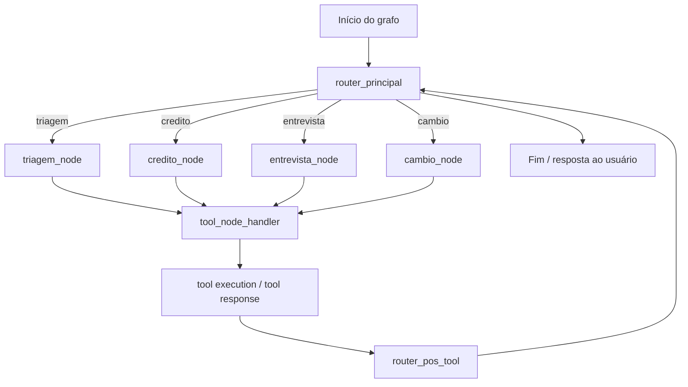

# Banco Ágil Agents

Este diretório contém a implementação modular dos agentes do sistema Banco Ágil.

## Estrutura

- `graph.py`
  - Orquestra o grafo de estado (`StateGraph`) e configura os nós de cada agente.
  - Importa os nós de agente individuais e os roteadores de `router.py`.

- `router.py`
  - Contém a lógica de roteamento e o handler de ferramentas.
  - Define `tool_node_handler`, `router_principal`, `router_pos_tool` e `router_tool_call`.
  - Também agrupa a lista `ALL_TOOLS` usada pelo `ToolNode`.

- `common.py`
  - Contém a criação do LLM (`_get_llm`) e o mapeamento de ferramentas para cada agente.
  - Importa `PROMPTS` de `prompts.py`.

- `prompts.py`
  - Centraliza todos os textos de prompt para os agentes: triagem, crédito, entrevista e câmbio.

- `triagem.py`
  - Define `triagem_node` usando `_build_agent_node("triagem")`.

- `credito.py`
  - Define `credito_node` com lógica customizada para reconhecimento de pedidos de aumento de limite.
  - Caso contrário, delega ao nó de crédito genérico.

- `credito_helpers.py`
  - Separa as funções auxiliares do agente de crédito:
    - detecção de pedido de aumento
    - extração de valores
    - formatação de resposta e chamada ao LLM

- `entrevista.py`
  - Define `entrevista_node` usando `_build_agent_node("entrevista")`.

- `cambio.py`
  - Define `cambio_node` usando `_build_agent_node("cambio")`.

## Como funciona

1. `graph.py` monta o grafo com os nós `triagem`, `credito`, `entrevista`, `cambio` e `tools`.
2. O roteador principal decide qual nó deve responder com base em `state["agente_atual"]`.
3. A execução de ferramentas é tratada em `router.py` para manter o grafo limpo.
4. Os prompts de cada agente estão centralizados em `prompts.py`, facilitando ajustes futuros.

## Diagrama de fluxo

## Benefícios desta organização

- manutenção mais rápida dos prompts e fluxos de cada agente
- lógica de roteamento isolada do grafo
- tratamento específico do agente de crédito separado em helpers reutilizáveis
- fácil extensibilidade para novos agentes ou regras de roteamento
